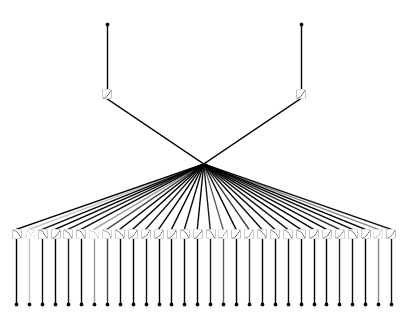
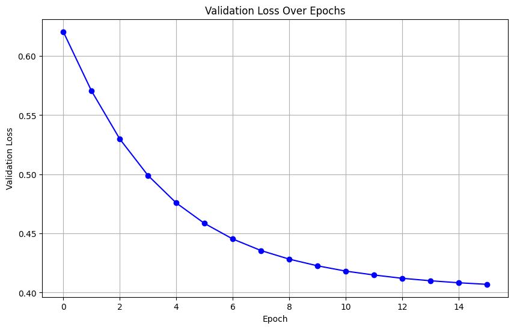
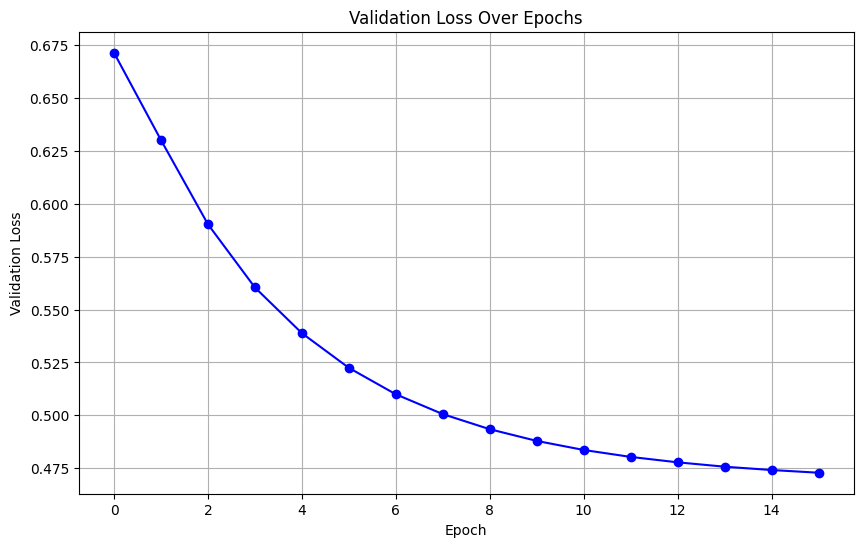
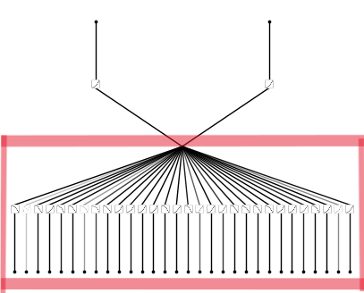
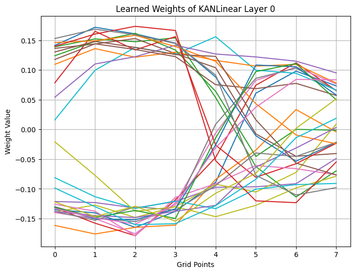
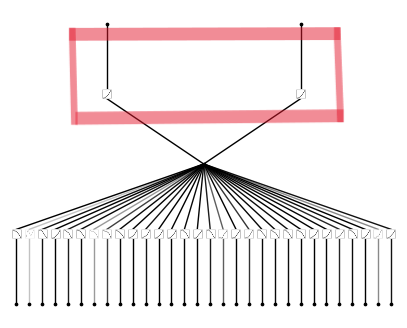
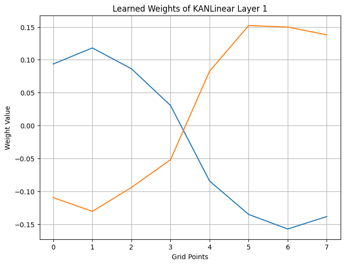

# Exploring-KANs

In this repository, I explore the performance of KANs on standard tasks in Machine Learning since the paper ["KAN: Kolmogorov-Arnold Networks"](https://arxiv.org/abs/2404.19756) focuses on applications in Physics and Mathematics.

Kolmogorov-Arnold Networks (KANs) are promising alternatives of Multi-Layer Perceptrons (MLPs). KANs have strong mathematical foundations just like MLPs: MLPs are based on the universal approximation theorem, while KANs are based on Kolmogorov-Arnold representation theorem. While MLPs have fixed activation functions on nodes ("neurons"), KANs have learnable activation functions on edges ("weights"). KANs have no linear weights at all -- every weight parameter is replaced by a univariate function parametrized as a spline. They show that this seemingly simple change makes KANs outperform MLPs in terms of accuracy and interpretability.

The original implementation of KAN is available [here](https://github.com/KindXiaoming/pykan).

I use [Blealtan's](https://github.com/Blealtan) efficient and PyTorch compatible implementation for easy use.

This implementation is available [here](https://github.com/Blealtan/efficient-kan)

Throughtout these experiments, a simple Feedforward Neural Network is also implemented alongside each KAN for comparison.

# Binary Classification On Tabular Data

For this task I chose the [Wisconsin Breast Cancer Dataset](https://scikit-learn.org/stable/modules/generated/sklearn.datasets.load_breast_cancer.html). It has **569** instances, and **30** features, and **2** class labels ('malignant' and 'benign').

## Architecture
Instead of learning individual weights with fixed activations, KANs have learnable activation functions on edges. Each weight parameter is replaced by a univariate function in the form of a spline.

The proposed architecture has one hidden layer, with **a single neuron**. There are 30 edges between the input layer and the hidden layer, and 2 edges between the hidden layer and the output layer, 32 edges in total.

**so our goal is to predict these 32 spline functions.**

The Fully Connected Neural Network architecture used for comparison has 2 hidden layers, with 16 and 8 neurons, respectively.

### Number Of Parameters

<table align="center">
  <tr>
    <th></th>
    <th>Parameters</th>
  </tr>
  <tr>
    <td>Our KAN</td>
    <td>320</td>
  </tr>
  <tr>
    <td>Our NN</td>
    <td>650</td>
  </tr>
</table>

Ziming Liu and his team have emphasized on their architecture's efficiency in terms of parameters. The KAN has less than half the parameters of the Neural Network. Increasing the number of Neurons actually made the KAN instantly overfit.

## Training
I trained both models with the Cross Entropy Loss, while tuning the hyperparameters to get the most out of each model. After trying multiple seeds and training cycles, it was clear that the KAN consistently converges to a lower loss in comparison to the NN.

The validation loss curves are as follows:

#### KAN Training
**Val Loss: 0.408**

#### NN Training
**Val Loss: 0.486**

## Interpretibility

While neural networks are notoriously known for not being interpretable. KANs show promise in interpretibility, Liu et al. have shown that these models can work backwards and find the exact function that the data fits on with almost machine precision. 

Similarly, we can plot the predicted splines and **obtain a visual and interactable representation of what our model has learned.** 
I found this very very interesting. 

### Splines For Input-to-Hidden Layer

#### The splines learnt by the edges between the input features and the neuron (highlighted above).

### Splines For Hidden-to-Output Layer

#### The splines learnt by the edges between the neuron and the output layer (highlighted above).

The Splines learnt by the output edges are particularly interesting. 

**They visualize that the model has captured the binary relationship between the 2 classes almost perfectly.**

These results indicate that KANs hold significant potential for applications in machine learning. Their ability to learn complex relationships in data while providing interpretable, and visual representations opens avenues for further exploration. 

With further research and development, KANs could emerge as the replacement of MLPs (the core foundation of Deep Learning).

All the code for this experiment is available in [winconsin.py](wisconsin.ipynb.IPYNB)

# Regression On Tabular Data
TODO
